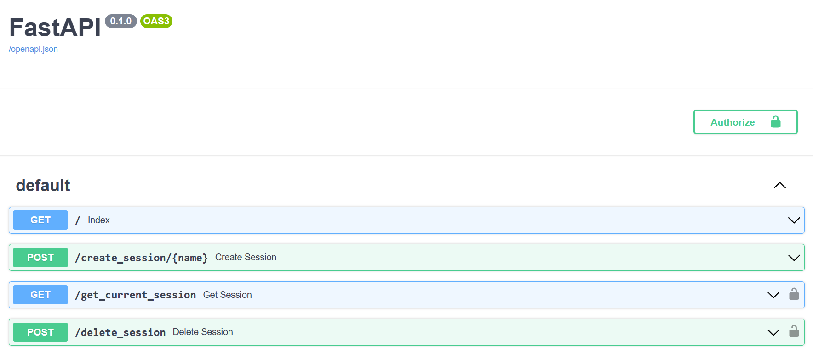

# Backend Sessions Implementation with FastAPI
The FastAPI code can be found in [sessions.py](sessions.py).

The automated documentation of the API can be seen below.

## Acknowledgements
This project is highly guided by [jordanisaacs' article](https://jordanisaacs.github.io/fastapi-sessions/guide/getting_started/).