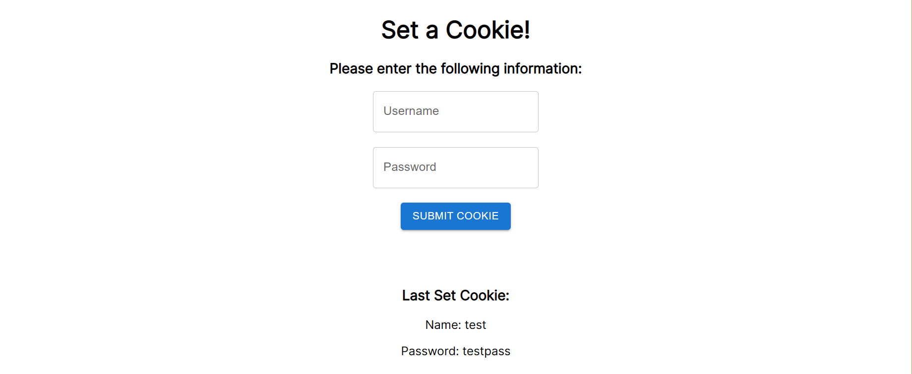

# Frontend Cookie Implementation with ReactJS
All related codes can be found in the [src](src) folder.

The result of running the app should be similar to the image below.

## Acknowledgements
This project is highly guided by [TutorialPoint's article](https://www.tutorialspoint.com/how-to-set-cookies-in-reactjs).

[MaterialUI](https://mui.com/material-ui/) was used as the CSS framework in this project.
